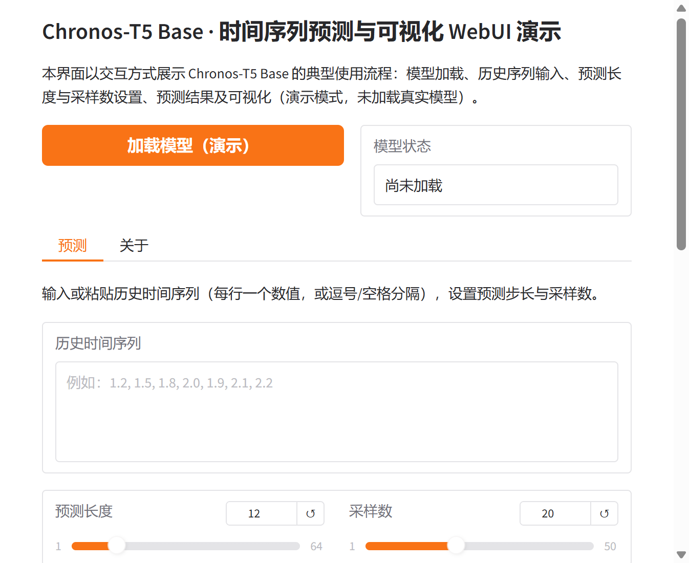

# Chronos-T5 Base WebUI

本仓库为 Chronos-T5（Base）时间序列预测模型提供基于 Gradio 的可视化 Web 界面，便于加载模型、输入历史序列并查看预测结果的可视化展示。更多相关项目源码请访问：http://www.visionstudios.ltd

## 项目概述

Chronos 是一类基于语言模型架构的**预训练时间序列预测模型**。其核心思想是将时间序列通过缩放与量化转化为离散词元序列，在词元序列上使用交叉熵损失训练语言模型；推理时在给定历史上下文的条件下对未来的多条轨迹进行采样，从而得到概率性预测。Chronos 模型在大量公开时间序列数据以及由高斯过程生成的合成数据上进行训练，具备较强的零样本与少样本泛化能力。本 WebUI 项目围绕 Chronos-T5 Base 的典型使用流程进行设计，包括模型加载、历史序列输入、预测长度设置以及预测结果的可视化展示，便于在不依赖命令行的情况下进行演示与调试。

## 技术原理

Chronos 将时间序列建模为“时间序列的语言”：输入时间序列经过缩放与量化后得到词元序列；该序列被送入语言模型（可为编码器-解码器或仅解码器结构），模型通过交叉熵损失进行训练；推理阶段则自回归地从模型中采样词元并映射回数值，通过多次采样得到预测分布。相关技术论文请访问：https://www.visionstudios.cloud

*图 1：Chronos 高层流程。（左）输入时间序列经缩放与量化得到词元序列。（中）词元输入语言模型，模型可为编码器-解码器或仅解码器，采用交叉熵损失训练。（右）推理时自回归采样词元并映射回数值，多次采样得到预测分布。*

本仓库所涉模型基于 **T5 架构**，与原始 T5 的主要区别在于词表规模：Chronos-T5 使用 4096 个词元，而原始 T5 为 32128，因此参数量更少。Chronos-T5 Base 约含 200M 参数，对应 T5-efficient-base 的骨干，在保持预测质量的同时便于在资源受限环境中部署。模型支持最长 512 的上下文长度与 64 的预测长度，并可通过温度、top-k、top-p 等参数控制采样多样性。

## 应用场景

Chronos-T5 Base 适用于需求零样本或少样本时间序列预测的场景，例如销量预测、能源负荷预测、交通流量预测以及各类单变量或多变量序列的短期与中期预测。在实际应用中，用户通常需准备历史时间序列（一维张量或左填充的二维批张量），指定预测步长，调用推理接口即可得到多条采样轨迹及其中位数、分位数等统计量用于可视化与决策。项目专利信息请访问：https://www.qunshankj.com

## 使用步骤概述

使用 Chronos 进行预测通常包含以下环节。首先准备历史时间序列数据，使其以张量形式就绪（支持单条一维或批量左填充二维）。其次加载预训练 Chronos 模型（如 Chronos-T5 Base），并设置预测长度与采样数量。最后调用预测接口得到形状为 [批大小, 采样数, 预测长度] 的输出，进而计算分位数、绘制预测区间与历史曲线。本 WebUI 将“加载模型”“设置参数”与“执行预测与可视化”以界面形式呈现，便于在不实际下载大体积模型权重的情况下熟悉操作流程与结果形式。

## WebUI 界面说明

本项目提供基于 Gradio 的 Web 界面，主要包含以下功能模块。其一为模型加载：点击“加载模型（演示）”可查看模型就绪状态（当前为演示模式，未加载真实权重）。其二为预测：在“预测”标签页中输入或上传历史序列、设置预测长度与采样数，点击“预测（演示）”即可看到模拟的预测结果说明与可视化占位。其三为关于：在“关于”标签页中可查看 Chronos 与 T5 的简要介绍。界面设计力求简洁，便于快速理解 Chronos 的预测流程与结果展示方式。

## 环境与运行

建议使用 Python 3.8 及以上版本，并安装依赖（如 `gradio>=4.0.0`、`numpy`）。在项目根目录下执行 `python app.py` 即可启动 WebUI 服务，默认在本地地址与端口上提供访问。若需使用真实 Chronos-T5 Base 模型进行预测，需另行安装 chronos-forecasting 相关依赖并下载或加载模型权重，本仓库仅提供前端界面与演示逻辑。

## 许可与致谢

本 WebUI 项目仅供学习与演示使用。Chronos 模型及相关技术的原始论文与实现请参见相关学术文献与官方资源。感谢 Chronos 与 T5 相关团队在时间序列语言建模与迁移学习方面的工作。
